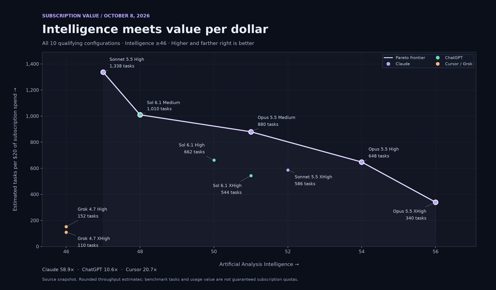

# Subscription Value

How much benchmark work does a subscription dollar buy, once we require an Artificial Analysis Intelligence score of **at least 46**?

This report compares estimated subscription throughput with intelligence using a snapshot dated **October 8, 2026**. The inputs are derived from SemiAnalysis's subscription-value research, Artificial Analysis benchmarks, and the author's Cursor usage exports.

**Explore the [interactive HTML report](index.html)**: a professional dark dashboard with linked chart and table selections, model search, provider and intelligence filters, sortable columns, a subscription-spend scenario control, and CSV export. Download the repository and open `index.html` in a browser; it works offline with no installation or build step. GitHub's file viewer displays the HTML source rather than running the report.

## Subscription multipliers

A multiplier represents estimated API-equivalent usage per subscription dollar; it is not itself a task count.

| Subscription | Multiplier | Interpretation in this comparison |
| --- | ---: | --- |
| Claude | **58.9×** | Applied to Sonnet 5.5 and Opus 5.5 |
| ChatGPT | **10.6×** | Applied to GPT-6.1 Sol |
| Cursor | **20.7×** | Applied to Grok 4.7 assuming both available usage pools are allocated to Grok |

The Claude and ChatGPT figures are estimates derived from [SemiAnalysis's API-equivalent subscription-value analysis](https://newsletter.semianalysis.com/p/anthropic-subscriptions-offer-5x). The Cursor figure comes from metered usage in the author's exports divided by subscription spend. That observed usage included both Grok and Claude; applying the whole multiplier to Grok assumes both available pools can be allocated to Grok. These inputs describe the workload and allocation assumptions used in this comparison.

## Qualifying configurations

All dollar amounts in the task-throughput comparison refer to **subscription fees**. API credits and on-demand usage charges are excluded. API-equivalent usage is an input used to estimate what the subscription buys; it is not the budget being spent.

In my experience, Grok 4.7 is the least capable model that can still complete math and coding work successfully in messy codebases. That makes its Artificial Analysis score of **46** my intelligence floor for this comparison. Your mileage may vary.

Only configurations with a known Artificial Analysis Intelligence score **≥46** and a known benchmark cost per task are included. Rows are sorted by **Tasks / $20 descending**. Sonnet 5.5 Medium is excluded because its score was 41; Grok 4.7 Medium is excluded because the required benchmark values were unavailable.

| Model | Reasoning | Intelligence | Subscription multiplier | Tasks / $20 subscription spend |
| --- | --- | ---: | ---: | ---: |
| Claude Sonnet 5.5 | High | 47 | 58.9× | **1,338** |
| GPT-6.1 Sol | Medium | 48 | 10.6× | **1,010** |
| Claude Opus 5.5 | Medium | 51 | 58.9× | **880** |
| GPT-6.1 Sol | High | 50 | 10.6× | **662** |
| Claude Opus 5.5 | High | 54 | 58.9× | **648** |
| Claude Sonnet 5.5 | XHigh | 52 | 58.9× | **586** |
| GPT-6.1 Sol | XHigh | 51 | 10.6× | **544** |
| Claude Opus 5.5 | XHigh | 56 | 58.9× | **340** |
| Grok 4.7 | High | 46 | 20.7× | **152** |
| Grok 4.7 | XHigh | 46 | 20.7× | **110** |

## Intelligence versus throughput



Higher and farther right is better. All ten points remain visible, including dominated configurations. A configuration is on the **Pareto frontier** when no other included configuration has at least as much intelligence and at least as many tasks per $20, with a strict improvement in one of those dimensions.

The frontier is:

**Sonnet 5.5 High → Sol 6.1 Medium → Opus 5.5 Medium → Opus 5.5 High → Opus 5.5 XHigh.**

Sonnet XHigh and Sol High/XHigh are dominated: Opus High improves both dimensions over Sonnet XHigh, and Opus Medium improves both dimensions over Sol High/XHigh. The connecting line is a visual guide between available configurations; intermediate points do not represent additional model tiers.

## Conclusion

- **Sonnet 5.5 High is the best raw Tasks / $20 option among qualifying configurations**, at **1,338** tasks and intelligence **47**.
- **Sol 6.1 Medium is second**, at **1,010** tasks and intelligence **48**, despite its lower subscription multiplier (**10.6× versus 58.9×**). Sonnet High delivers **32.5% more tasks for the same subscription spend**, while Sol Medium offers one extra intelligence point.
- **Opus 5.5 Medium, High, and XHigh define the higher-intelligence Pareto frontier**, trading throughput for scores of **51, 54, and 56**.
- **Grok 4.7 is much less subscription-efficient under this metric**, at **152** tasks for High and **110** for XHigh, both with intelligence **46**. Product features or a different workload may still change a personal subscription decision.

## Method and limits

```text
Tasks per subscription dollar = subscription multiplier / AA benchmark cost per task
Tasks per $20 = 20 × tasks per subscription dollar
```

Tasks per subscription dollar are rounded to **one decimal place before multiplying by 20**. For example, `58.9 / 0.88 ≈ 66.9`, then `66.9 × 20 = 1,338`. Computing directly from the unrounded ratio can yield a slightly different number. The dashboard scales these values linearly for its subscription-spend scenarios.

The $20 figure normalizes subscription fees to a common amount, not a claim that every service offers a $20 plan or that these task counts are guaranteed monthly quotas. Benchmark task costs, API-equivalent usage estimates, context sizes, usage limits, and real coding tasks are different quantities. This metric does not measure task success rates, latency, tools, or the IDE experience. Figures reflect the October 8, 2026 snapshot; scores, prices, and subscription limits can change.

### Sources

Three sources supply the inputs used to calculate this table:

- **[SemiAnalysis — Anthropic Subscriptions Offer 5x+ More Value Than OpenAI](https://newsletter.semianalysis.com/p/anthropic-subscriptions-offer-5x)** — API-equivalent subscription-value research used to derive the Claude and ChatGPT multipliers.
- **Artificial Analysis** — Intelligence Index scores and benchmark cost inputs for each model and reasoning configuration. Model comparisons: [Sonnet 5.5](https://artificialanalysis.ai/models/comparisons/claude-sonnet-5-5-high-vs-claude-sonnet-5-5-xhigh), [Opus 5.5](https://artificialanalysis.ai/models/comparisons/claude-opus-5-5-medium-vs-claude-opus-5-5-xhigh), [Sol 6.1](https://artificialanalysis.ai/models/comparisons/gpt-6-1-sol-medium-vs-gpt-6-1-sol-xhigh), and [Grok 4.7](https://artificialanalysis.ai/models/comparisons/grok-4-7-high-vs-grok-4-7).
- **Cursor usage exports** — the author's observed metered API-equivalent usage divided by subscription spend, yielding the **20.7×** Cursor multiplier. It reflects the observed usage mix rather than a guaranteed allowance for every account.

The HTML retains the recorded benchmark costs as calculation inputs in its embedded dataset. The dashboard and CSV export present subscription throughput, intelligence, and multipliers. Its chart and table use the same preserved values.

## Report checks

Run `node checks/report.mjs` to check the qualifying rows, rounding, README table, and Pareto membership. No external packages are needed.
